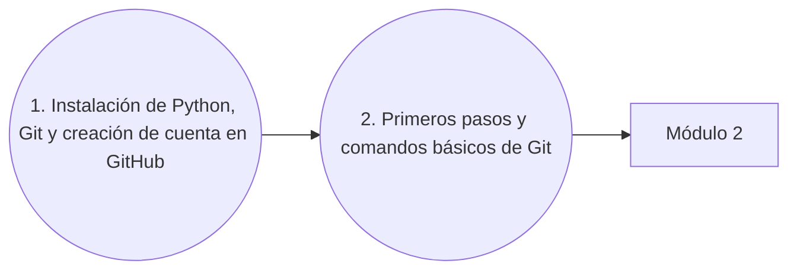

# Módulo 1: Herramientas fundamentales

¡Bienvenido al módulo inicial! Aprenderemos a descargar e instalar Python y a manejar de forma básica Git. Algo imprescindible hoy en día.

Este primer módulo es mayormente práctico, por lo tanto todo el contenido se encuentra en formato vídeo, con el objetivo de simplificar las instrucciones de instalación de las herramientas.

---

## Flujo del módulo

##  Vídeos y contenido

### 1. Cómo descargar e instalar Python, instalar Git y crear cuenta en GitHub
> **Enlace al vídeo:** [Ver vídeo en YouTube](https://youtu.be/ZDaW7sgYZzk)

**Contenido:**
* Instalación de Python
* Instalación de Git
* Configuración básica de Git
* Creación de cuenta en GitHub

### 2. Git desde cero: primeros pasos y comandos Básicos
> **Enlace al vídeo:** [Ver vídeo en YouTube](https://youtu.be/il-ZSBh0PAo)

**Contenido:**
* ¿Qué es Git? y ¿Qué es GitHub?
* **Comandos esenciales:** `git init`, `git branch`, `git status`, `git add`, `git commit`.
* ¿Qué es un commit?
* **Conexión con GitHub:** `git remote add`, `git push`, `git clone`.
