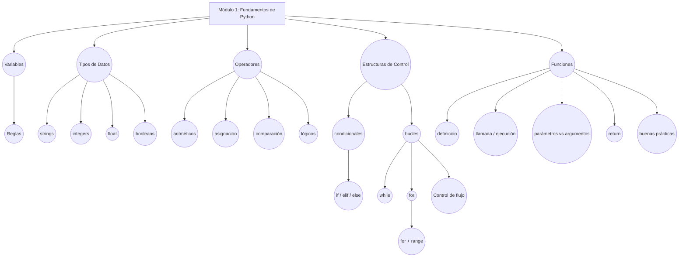

# Módulo 1. Fundamentos básicos de Python
> **Enlace al vídeo:** [Ver vídeo de Youtube](https://youtu.be/SIYNHiLDcjc)

---

## Flujo del módulo



## Índice

* [**Las Variables**](#las-variables)
    * [Caracteres válidos](#caracteres-válidos)
    * [Caracteres no permitidos](#caracteres-no-permitidos)
    * [Palabras clave](#palabras-clave)
* [**Tipos de datos**](#tipos-de-datos)
    * [Strings](#strings)
    * [Integers](#integers)
    * [Float](#float)
    * [Booleans](#booleans)
* [**Operadores**](#operadores)
    * [Operadores aritméticos](#operadores-aritméticos)
    * [Operadores de asignación](#operadores-de-asignación)
    * [Operadores de comparación](#operadores-de-comparación)
    * [Operadores lógicos](#operadores-lógicos)
* [**Expresiones y declaraciones**](#expresiones-y-declaraciones)
* [**Estructuras de control**](#estructuras-de-control)
    * [Condicionales](#condicionales)
    * [Bucles](#bucles)
        * [Bucle _while_](#bucle-while)
        * [Bucle _for_](#bucle-for)
            * [El uso del bucle for con la función range()](#el-uso-del-bucle-for-con-la-función-range)
        * [Controlando el flujo del bucle](#controlando-el-flujo-del-bucle)
* [**Las funciones**](#las-funciones)
    * [Cómo definir una función](#cómo-definir-una-función)
    * [Cómo llamar a una función](#cómo-llamar-a-una-función)
    * [Parámetros y argumentos](#parámetros-y-argumentos)
    * [El uso de return en una función](#el-uso-de-return-en-una-función)
    * [Buenas prácticas](#buenas-prácticas)
    
---


## Las Variables

Podemos entender las variables como **contenedores** a los que les asignamos un valor determinado. Por ejemplo: imaginemos que ya no nos caben más libros en la estantería de casa, llenamos una caja con veinte libros para guardarlos en el trastero y por fuera escribimos "veinte libros" y la guardamos en un sitio accesible con el nombre visible. Cuando pase el tiempo y queramos recuperar esos libros, porque tenemos una estantería nueva, sabremos perfectamente donde está la caja y qué contiene. Escrito en un variable se vería así:

```python
veinte_libros = 20
```

Elegir un buen nombre para tus variables es más que una simple formalidad; es una habilidad fundamental para escribir código que no solo funcione, sino que sea fácil de entender para ti y para los demás. Python tiene algunas reglas estrictas que debes seguir, así como algunas convenciones que toda la comunidad usa para que el código sea legible y consistente.

### Caracteres válidos

El nombre de una variable solo puede contener: letras de la A a la Z, preferiblemente en minúsculas, números del 0 al 9 y el guión bajo como separador. Esto significa que cualquier otro carácter no es válido. Esta forma de escribir las variables recibe el nombre de **snake\_case**. Ejemplo:

```python
como_escribir_variables 
```

**\*Importante**: Los números están permitidos pero una variable no puede empezar por un número.

### Caracteres no permitidos

Ninguno de los caracteres especiales debe ser usado para nombrar variables:

```python
! @ # $ % ^ & * - + = ? > < . , / | \ { } [ ] ( ) : ; ' " (espacio) 
```

### Palabras clave

Las palabras clave (keywords) son las palabras que Python ha reservado para su propio uso y funcionamiento. No se pueden usar como nombres de variables:

```python
False  None  True  and  as  assert  async  await  break  class  continue  def 
del  elif  else  except  finally  for  from  global  if  import  in  is 
lambda  nonlocal  not  or  pass  raise  return  try  while  with  yield 
```

Iremos identificando todas estas palabras clave durante nuestro aprendizaje. [Las reglas de escritura y convenciones](https://peps.python.org/pep-0008/) están disponibles en la documentación sobre estilos de PEP 8.

## Tipos de datos

Los tipos de datos son el tipo de información que guardamos dentro de las variables, que pueden ser:

*   **Cadenas de caracteres (strings)**: Tienen tipo **str** y representan información textual.
*   **Números enteros (integers)**: Tienen tipo **int** y representan números sin parte decimal, tanto positivos como negativos (ej. -1, 22, -5, 100).
*   **Números decimales (float)**: Representan números con parte decimal y tienen tipo **float** (ej. 5.0, 2.4, 9.8).
*   **Booleanos (booleans)**: Son fundamentales, se utilizan en expresiones condicionales y operaciones lógicas. Solo pueden tener dos valores: True (verdadero) o False (falso) y tienen tipo **bool**.

Veamos algunos ejemplos pero, antes de comenzar, explico cómo llevar a cabo la lectura del código. Lo que veremos será una simulación de cómo se ve realmente el intérprete de Python en nuestra terminal. Las líneas en las que aparecen las tres flechitas _\>>>_ significa que el intérprete está esperando que introduzcamos un comando o entrada. Una vez introducido, pulsamos _Enter_ y en la siguiente línea nos dará la salida o resultado procesado. Los tres puntos _..._ significan que esa línea de código pertenece al mismo bloque de código que la línea anterior.

Otra cosa que yo considero importante es familiarizarse con los términos en inglés y, por supuesto, dominar lo máximo posible este idioma. Y os voy a motivar, el inglés se valora y hay posibilidades de conseguir un salario mayor.

### Strings

Se pueden encerrar en comillas simples ('...') o comillas dobles ("...") con el mismo resultado.

```python
'Estudio Python' # entrada
'Estudio Python' # salida

"Estudio Python" # entrada
'Estudio Python' # salida
```

### Integers

No es necesario escribirlos entre comillas, si lo hiciéramos, estaríamos introduciendo un **string** en lugar de un **integer**.

```python
2 + 2 # suma de integers
4 # resultado
"2 + 2" # string
'2 + 2'
```

### Float

Tampoco es necesario escribirlos entre comillas e igual que los integers representan tanto números negativos como positivos. Las operaciones entre un integer y un float darán como resultado un float. Recordemos que son **números decimales**.

```python
4 + 3.4 # integer + float 
7.4
7.4 - 0.4 # float - float
7.0
```

### Booleans

Son valores especiales que no son cadenas de caracteres ni números y representan la verdad o falsedad de una afirmación o condición. Es importante recordar que **True** y **False** se escriben con la primera letra en mayúscula.

Podemos comparar los booleans con un interruptor. Un interruptor solo tiene dos estados: encendido (True) y apagado (False).

```python
# encerramos en variables los dos estados booleanos 
encendida = True
apagada = False

# asignamos los estados
luz_cocina = encendida
luz_baño = apagada
```

Y utilizamos la función **print()** para para ver el resultado de nuestro código. También sirve para depurar errores y comunicarte con el usuario a través de la terminal.

```python
print(luz_cocina)
True
print(luz_baño)
False
```

Según vayamos avanzando, descubriremos cosas muy interesantes acerca de los booleans.

## Operadores

Los operadores básicos en Python son **símbolos que realizan operaciones** sobre uno o más valores. Son la base para cualquier cálculo, comparación o decisión que tomes en tu código. Veamos los tipos de operadores que podemos encontrar:

### Operadores aritméticos

Los operadores aritméticos son comúnmente utilizados en Python para cálculos matemáticos:

| Operador | Nombre | Ejemplo | Total |
| --- | --- | --- | --- |
| +   | Suma | 5 + 2 | 7   |
| \-  | Resta | 4 - 2 | 2   |
| \*  | Multiplicación | 2 \* 5 | 10  |
| /   | División | 5 / 2 | 2.5 |
| //  | División entera | 5 // 2 | 2   |
| %   | Módulo | 5 % 2 | 1   |
| \*\* | Potencia | 5 \*\* 2 | 25  |

La división **/** siempre retorna un número decimal (float). Para hacer una división entera a la baja (floor division) y obtener un número entero como resultado puede usarse el operador **//** y para calcular el resto puedes usar **%**. Lee más sobre esto en la documentacion oficial de Python sobre la [división entera a la baja](https://docs.python.org/es/3/glossary.html#term-floor-division).

Ejemplo:

```python
19 / 4 # devuelve un float
4.75
19 // 4 # descarta la parte decimal 
4
19 % 4 # devuelve el resto
3
4 * 4 + 3 # cociente entero x divisor + resto 
19
```

Con respecto al operador módulo **%** da como resultado 3 porque 4 cabe 4 veces en 19 y me sobran 3 (resto). Parece una tontería pero ayuda verlo de esta manera.

Los paréntesis **()** no son considerados operadores aritméticos como tal pero se usan para agrupar operaciones y controlar el orden en que se realizan.

```python
25 - 2*3 # entrada 
19 # salida 
(25 - 2*3) / 2 # entrada 
9.5 # salida
```

### Operadores de asignación

Estos operadores se usan para **asignar valores a variables**. El operador más básico es el **\=** pero existen operadores de asignación combinados con operaciones aritméticas que normalmente suelen abreviarse:

| Operador | Abreviación | Equivalente |
| --- | --- | --- |
| \=  | x = 2 | Asigna 2 a x |
| +=  | x += 2 | x = x + 2 |
| \-= | x -= 2 | x = x - 2 |
| \*= | x \*= 2 | x = x \* 2 |
| /=  | x /= 2 | x = x / 2 |
| //= | x //= 2 | x = x // 2 |
| %=  | x %= 2 | x = x % 2 |
| \*\*= | x \*\*= 2 | x = x \*\* 2 |

En las operaciones de asignación, Python siempre evalúa primero la parte derecha del símbolo **\=** y luego asigna ese resultado a la variable de la izquierda sobreescribiendo su valor original. Ejemplo:

```python
x = 4
#---Operador de asignación con suma---
x += 2 # es x = 4 + 2
print(x)
6

#---Operador de asignación con multiplicación--- 
x *= 2 # es x = 4 * 2
print(x)
8

#---Operador de asignación con potencia--- 
x **= 2 # es x = 4 ** 2
print(x)
16
```

### Operadores de comparación

Estos operadores se usan para comparar valores y siempre **devuelven un valor booleano** (True o False):

| Operador | Nombre | Ejemplo | Resultado |
| --- | --- | --- | --- |
| \== | Igual que | 6 == 2 | False |
| !=  | Diferente que | 6 != 2 | True |
| \>  | Mayor que | 6 > 2 | True |
| <   | Menor que | 6 < 2 | False |
| \>= | Mayor o igual que | 6 >= 2 | True |
| <=  | Menor o igual que | 6 <= 2 | False |

Ejemplo:

```python
# comparamos strings 
palabra1 = 'estudio'
palabra2 = 'python'
print(palabra1 == palabra2) # ¿es palabra1 igual que palabra2? 
False

palabra3 = 'cada'
palabra4 = 'día'
print(palabra3 != palabra4) # ¿es palabra3 diferente que palabra4? 
True

# comparamos integers
Juan = 30
Ana = 23
print(Juan > Ana) # ¿es Juan mayor que Ana?
True
print(Ana <= Juan) # ¿es Ana menor o igual que Juan? 
True

# comparamos booleans
On = True
Off = False
alarma = On
print(alarma == Off) # ¿es alarma igual que Off?
False
```

Si te ves con ganas, échale un vistazo a la [documentación oficial de Python sobre las comparaciones](https://docs.python.org/es/3.13/library/stdtypes.html#comparisons).

Veremos también, dentro de poco, los operadores de pertenencia y los operadores de identidad. Pero de momento es suficiente con saber que existen.

### Operadores lógicos

También llamados operadores booleanos, se utilizan para combinar expresiones lógicas y evaluar si son verdaderas o falsas. A la hora de construir la lógica de nuestro proyecto, debemos tener en cuenta la prioridad que tienen estos operadores entre ellos:

| Operador | Prioridad | Ejemplo | Resultado |
| --- | --- | --- | --- |
| and | 2   | True and False | False |
| or  | 3   | True or False | True |
| not | 1   | not True | False |

El operador **and** evalúa si todas las condiciones son verdaderas, si la primera es falsa dará como resultado _False._ Imagina que vas a sacar dinero del banco, necesitas para ello tu tarjeta bancaria e introducir un código Pin ¿verdad?, si no dispones de la primera no puedes sacar dinero. Ejemplo:

\* Este operador solo evalúa la segunda condición si la primera es verdadera (lógica de cortocircuito).

```python
tarjeta = True
pin = True
print(tarjeta and pin) # ¿Hay tarjeta y el pin es correcto? 
True

tarjeta = True
pin = False
print(tarjeta and pin) # ¿Hay tarjeta pero el pin no es correcto? 
False
```

El operador **or** evalúa si alguna de las condiciones es verdarera, si todas son falsas dará como resultado _False_. Para este caso imagina que vas al cine, puedes llevar tu entrada impresa o tu entrada digital en el móvil. Si dispones de alguna de las dos opciones el empleado del cine escanea la entrada, verifica que es correcta, y puedes entrar. Si no llevas ninguna de las dos pues verás la película en casa. Ejemplo:

\* Este operador solo evalúa la segunda condición si la primera es falsa (lógica de cortocircuito).

```python
entrada_papel = False
entrada_digital = True
print(entrada_papel or entrada_digital) # ¿no tienes entrada en papel pero sí digital? 
True

entrada_papel = True
entrada_digital = False
print(entrada_papel or entrada_digital) # ¿tienes entrada en papel pero no digital?
True

entrada_papel = False
entrada_digital = False
print(entrada_papel or entrada_digital) # ¿no tienes ninguna de las dos? 
False
```

El operador **not** invierte el valor de una condición, es decir, si la condición original es verdadera la convertirá en falsa y viceversa. Ejemplo:

```python
luz_encendida = True
luz_apagada = not luz_encendida
print(luz_encendida)
True
print(luz_apagada)
False
```

Las operaciones lógicas deben resolverse **respetando el orden de prioridad**. Recuerda que el operador lógico de mayor prioridad es **not**, después **and** y por último **or**. Ejemplo:

```python
a = True
b = False
c = True

resultado = a or not b and c # esto es: True or not False and True 
print(resultado)
True
```

Se despeja **not b** y el valor invertido de **b** es igual a **True** lo que modifica la expresión hacia: **a or True and c.**

Seguidamente se evalúa **True and c** que es lo mismo que **True and True** modificando la expresión de esta forma: **a or True**.

Y por último se evalúa **a or True** que es igual a **True or True** modificando la expresión a un solo valor **True** que se asigna finalmente a la variable **resultado**. (Veremos lo que son las expresiones, en el siguiente apartado).

Al igual que en las operaciones aritméticas, con los paréntesis también podemos agrupar y cambiar el orden de prioridad en las operaciones lógicas.

Por último, es importante saber que los operadores aritméticos y los de comparación tiene prioridad ante los operadores lógicos. Ejemplo:

```python
5 * 3 > 10 and 2 + 2 == 4
```

Primero se evalúan las operaciones aritméticas **5 \* 3** es **15** y **2 + 2** es **4** lo que simplifica la expresión a:

```python
15 > 10 and 4 == 4
```

Luego las operaciones de comparación **15 > 10** es igual a **True** y **4 == 4** es igual **True**, lo que reduce la expresión a:

```python
True and True # da como resultado True 
```

Te recomiendo ojear la [documentación de Python sobre los operadores lógicos](https://docs.python.org/es/3.13/library/stdtypes.html#boolean-operations-and-or-not).

## Expresiones y declaraciones

La diferencia entre ellas es que una expresión se evalúa (se calcula) y da como resultado un valor único mientras que una declaración realiza una acción. En inglés las reconoceremos como **expressions** y **statements**. Ejemplo:

```python
10 + 2 # la expresión se evalúa a 12 
12
```

Pero, sin una declaración, perdemos el valor resultante de la evaluación de la expresión. Es decir: no podemos utilizar ese valor más adelante en nuestro programa porque no tenemos forma de llamarlo o identificarlo. Debemos ordenar al intérprete de Python que almacene ese valor resultante en una variable para usarlo cuando queramos o necesitemos. Ejemplo:

```python
x = 10 + 2 # la declaración asigna el valor resultante 12 a la variable x 
```

La acción que lleva a cabo la declaración es la de **asignar a x** el resultado de la expresión **10 + 2**.

Las expresiones no son únicamente cálculos numéricos. También pueden ser cadenas de caracteres, valores lógicos, llamadas a funciones o una combinación entre todas ellas que, a partir de ahora, iremos identificando poco a poco.

## Estructuras de control

Las estructuras de control en Python nos permiten controlar el flujo de ejecución de nuestro programa. El intérprete de Python ejecutará nuestro programa de forma lineal a no ser que nosotros le digamos lo contrario. ¿Y cómo hacemos esto? Pues aplicando condiciones y o bloques de repetición.

### Condicionales

Los condicionales permiten que nuestro programa avance en una dirección u otra dependiendo de si la condición es verdadera o falsa. Si tuviéramos que aplicar esta lógica en una frase, lo haríamos así: "Si llueve, me quedo en casa; si no, iré a la playa."

Para crear una estructura de control condicional, usamos la palabra clave **if** para la condición principal, y opcionalmente podemos añadir **elif** y **else**. La primera de ellas, es la más básica. Si la condición es verdadera ejecutará el código, sino, simplemente lo ignorará. Ejemplo:

```python
if 2 == 2: # es verdad, ejecuta el código 
   print("son iguales")

son iguales

if 2 == 3: # no es verdad, lo ignora
   print("no son iguales") 
```

Podemos combinar **if** con **else**. Si la primera condición es verdadera se ejecutará el bloque de código dentro de **if**, sino, se ejecutará el bloque de código dentro de **else**. Esta estructura coincide con la frase que has leído antes: "Si llueve, me quedo en casa; si no, iré a la playa."

Ejemplo:

```python
if 2 == 2: # si verdadero, imprime son iguales  
   print("son iguales")
else: # sino, imprime no son iguales 
   print("no son iguales") 

son iguales

if 2 == 3: # si falso, lo ignora
   print("son iguales") 
else: # entonces imprime no son iguales
   print("no son iguales") 

no son iguales
```

Para evaluar múltiples condiciones combinaremos **if** con tantos **elif** como sean necesarios y si no se cumple ninguna de las condiciones anteriores, se ejecutará el bloque de código dentro de **else**. Este ejemplo va a ser un poco más entretenido, vamos a poner en práctica los operadores de comparación y operadores lógicos que vimos en apartados anteriores.

```python
llueve = True
playa = True
casa = True

if llueve == False:
   print("Voy a la playa") 
elif not playa:
   print("Me quedo en casa") 
elif llueve and casa == True:
   print("veré una película de miedo") 
else:
   print("¿Tú irás aunque llueva?")

veré una película de miedo
```

Las dos primeras condiciones son falsas. Por lo tanto, son ignoradas. Una vez que se encuentra una condición verdadera, el resto de las condiciones **(else)** también son ignoradas, y el flujo del programa sale del bloque condicional. Te dejo un enlace hacia la [documentación del if statement](https://docs.python.org/es/3/tutorial/controlflow.html#if-statements).

### Bucles

Los bucles (o **loops**) nos permiten automatizar tareas repetitivas. Piensa en ellos como la forma de darle a tu programa una serie de instrucciones para que las repita una y otra vez sin tener que escribir cada paso manualmente. En Python existen dos tipos de bucles:

#### Bucle _while_

Con este bucle podemos repetir el mismo bloque de código siempre que una condición sea verdadera. Para crear este bucle usaremos la palabra clave **while**. Imagina que tienes una página web donde vendes entradas. Necesitas automatizar el proceso de venta, para que en la página web, despúes de cada compra, se muestre el número real de entradas todavía disponibles:

```python
entradas = 10

while entradas > 0: # mientras entradas sea mayor que 0 se ejecutará el bloque 
   print("entradas disponibles:", entradas) # entradas es igual a 10 
   entradas -= 1 # 10 - 1 (operador de asignación)
   if entradas == 0: # si entradas es igual a 0 imprime el mensaje
       print("¡entradas agotadas!")

entradas disponibles: 10 
entradas disponibles: 9
entradas disponibles: 8
entradas disponibles: 7
entradas disponibles: 6
entradas disponibles: 5
entradas disponibles: 4
entradas disponibles: 3
entradas disponibles: 2
entradas disponibles: 1
¡entradas agotadas!
```

Este código seguirá restando entradas hasta que el contador llegue a cero, mostrando en cada paso cuántas quedan. Es un ejemplo simplificado, funcionará si permites comprar solo una entrada por cliente.

**\*Importante**: Cuando trabajes con bucles, asegúrate de que la condición en algún momento se vuelva falsa para **evitar un bucle infinito**. Si te sucede, no te asustes: **presiona Ctrl + C** en tu terminal para detener el programa.

#### Bucle _for_

Recorre los elementos de una secuencia (como una lista) uno a uno para realizar una acción en cada uno de ellos. Usaremos la palabra clave **for** para crear este tipo de bucle. Piensa en el **bucle for** como si fuera un robot que trabaja en la línea de montaje de una fábrica cerrando cajas de diferentes tamaños. El robot retira de la cinta cada caja, una por una, y las cierra. Ejemplo:

```python
cajas = ["tamaño S", "tamaño M", "tamaño L"] # lista de cajas (línea de montaje) 

for caja in cajas: # para cada caja en la línea de montaje, el robot hace lo siguiente: 
   print("procesando caja:", caja, "cierre efectuado.") 

procesando caja: tamaño S cierre efectuado.
procesando caja: tamaño M cierre efectuado.
procesando caja: tamaño L cierre efectuado.
```

Este bucle (robot) selecciona cada elemento de la lista **cajas** (primero "tamaño S", luego "tamaño M", y así sucesivamente hasta que se terminen los elementos de la lista) y ejecutará la instrucción print para cada uno. ¡Así de fácil automatizas una tarea repetitiva!

##### El uso del bucle for con la función range()

Esta combinación es muy práctica a la hora de automatizar tareas que no dependen de una lista de elementos, sino de un número fijo de repeticiones. En este caso, no necesitamos que nuestro robot manipule una lista de cajas. Simplemente queremos que haga sonar una alarma tres veces seguidas. Ejemplo:

```python
for _ in range(3): # por cada repetición, el robot hace lo siguiente: 
   print("¡bip, bip!") # sonido de alarma 

¡bip, bip!
¡bip, bip!
¡bip, bip!
```

Con la declaración **for \_ in range(3)**: lo que estamos haciendo es iniciar un **bucle for** que utiliza, en este caso, la variable **guión bajo** ( \_ ) para contar las repeticiones que **in range(3)** le ha indicado. Una vez el bucle haya efectuado las tres repeticiones, se detendrá.

Pero, ¿qué hacen exactamente la función **range()** y la variable de conteo **guión bajo** ( \_ )? Esta función genera una secuencia de números enteros para que el **bucle for** sepa cuántas veces debe repetir una acción.

**\*Importante**: En Python siempre se empieza a contar desde cero.

Ejemplo:

```python
range(3): # genera la secuencia: 0, 1, 2 
```

Para entenderlo mejor, se puede decir que le pedimos a **range()** el total de repeticiones que queremos, la función traduce nuestra petición y devuelve una secuencia de **índices** o **posiciones** (valores) que necesita el bucle para contar estas repeticiones. Como en Python el conteo siempre empieza en cero, la secuencia que nos devuelve es **0, 1, 2**.

En Python, el **bucle for** siempre necesita una variable para almacenar el valor de cada elemento que recorre. En cada repetición del bucle, la variable de conteo (**guión bajo \_**) se convierte, temporalmente, en cada uno de los números de la secuencia:

*   **1ª repetición**: El guion bajo \_ toma el valor de 0.
*   **2ª repetición**: El guion bajo \_ toma el valor de 1.
*   **3ª repetición**: El guion bajo \_ toma el valor de 2.

Una vez asignados todos los valores de la secuencia, el bucle se detiene. La variable de conteo **guión bajo ( \_ )**, simplemente se usa como un marcador de posición para cumplir con la sintaxis, indicando a otros programadores que el valor de esa variable no se va a usar.

Si queremos utilizar el valor de la variable, usaremos un nombre más descriptivo. Imagina que queremos, que el robot ponga etiquetas en 5 cajas:

```python
for caja in range(5): # por cada caja, el robot hace lo siguiente: 
   print("pegando etiqueta en caja número:", caja + 1) # la acción de etiquetar 

pegando etiqueta en caja número: 1
pegando etiqueta en caja número: 2
pegando etiqueta en caja número: 3
pegando etiqueta en caja número: 4
pegando etiqueta en caja número: 5
```

Aquí, la variable **caja** se usa dentro del bucle. En cada repetición, **caja** selecciona un valor de la secuencia dada por range(5) **\=** (0, 1, 2, 3, 4). Por eso, tienes que usar **caja + 1** para que las etiquetas empiecen en **1** y no en **0**.

#### Controlando el flujo del bucle

Utilizando las palabras clave **break** y **continue** podemos detener el bucle por completo o saltar a la siguiente iteración, respectivamente.

Imagina que nuestro robot tiene que procesar 8 cajas, pero en el lugar de la caja número 4 encuentra en la línea de montaje un objeto que no es una caja, una rueda por ejemplo. Debemos detener el bucle porque no queremos que el cliente reciba una rueda en lugar de su caja con su contenido.

Aquí, el bucle, tiene la intención de repetirse 8 veces. Veamos cómo **break** nos permite detener el proceso inmediatamente:

```python
cajas_procesadas = 0
objeto_desconocido = 4

while cajas_procesadas < 8: 
   cajas_procesadas += 1
   if cajas_procesadas == objeto_desconocido: 
       print("¡ALERTA! objeto desconocido | proceso detenido.") 
       break # en la cuarta repetición el bucle se detiene
   print("procesando caja número:", cajas_procesadas)

procesando caja número: 1
procesando caja número: 2
procesando caja número: 3
¡ALERTA! objeto desconocido | proceso detenido.
```

La palabra clave **break** se activa porque la condición de la que forma parte es verdadera. Cuando se activa, **detiene el bucle por completo**, y la ejecución del programa continúa con la primera línea de código que esté fuera del bucle. Si la condición fuera falsa, sería ignorada.

Para el uso de la palabra clave **continue**, vamos a imaginarnos la misma situación. Sin embargo, esta vez, nuestro robot no detendrá todo el proceso; simplemente **ignorará el objeto desconocido y pasará a la siguiente caja**, ya que en la línea de montaje hay otro robot encargado de separar esos objetos:

```python
cajas_procesadas = 0
objeto_desconocido = 4

while cajas_procesadas < 8: 
   cajas_procesadas += 1
   if cajas_procesadas == objeto_desconocido: 
       print("objeto ignorado.") 
       continue # en la cuarta repetición el objeto es ignorado 
   print("procesando caja número:", cajas_procesadas) 

procesando caja número: 1
procesando caja número: 2
procesando caja número: 4
objeto ignorado.
procesando caja número: 5
procesando caja número: 6
procesando caja número: 7
procesando caja número: 8
```

Cuando se activa la palabra clave **continue**, ignora el objeto y el bucle continua.

No solo podemos controlar el flujo de los **bucles while**, también es aplicable a los **bucles for**. Imagina que el robot tiene una lista de cajas para procesar, pero su trabajo es encontrar la caja que contiene un "paquete frágil" y, en cuanto la encuentra, debe detener todo el proceso:

```python
cajas = ["caja A", "caja B", "paquete frágil", "caja C", "caja D"] 

for caja in cajas:
   if caja == "paquete frágil":
       print("¡encontrado paquete frágil! línea de montaje detenida.") 
       break
   print("procesando", caja)

procesando caja A
procesando caja B
¡encontrado paquete frágil! línea de montaje detenida.
```

Vamos a ver el mismo ejemplo utilizando **continue**, en lugar de detener la línea de montaje, el paquete frágil será ignorado y continuará procesando el resto de cajas de la lista:

```python
cajas = ["caja A", "caja B", "paquete frágil", "caja C", "caja D"] 

for caja in cajas:
   if caja == "paquete frágil":
       print("paquete frágil, ignorado.") 
       continue
   print("procesando", caja)

procesando caja A
procesando caja B
paquete frágil, ignorado.
procesando caja C
procesando caja D
```

Como hemos visto, son herramientas tremendamente útiles que hacen que nuestro programa sea mucho más potente y flexible.

## Las funciones

Las funciones son **bloques de código que podemos reutilizar**, una y otra vez, sin tener que escribir el código en cada ocasión. Podemos escribirlas nosotros según nuestras necesidades, o vienen ya predefinidas (built-in) en Python para ser usadas directamente como por ejemplo: la función **range()** que ya hemos visto y la función **print()**. Que como has podido observar, usamos bastante.

### Cómo definir una función

Para definir una función usaremos la palabra clave **def**. Junto a a la palabra clave escribiremos el nombre de la función y añadiremos unos paréntesis. Ejemplo:

```python
def bienvenido(): # def y nombre de función 
    print("bienvenido a DevsdeCero.") # acción de la función 
```

\***Importante**: El bloque de código (cuerpo de la función) que va después de los dos puntos, como hemos visto con los bucles y con los condicionales, debe respetar la sangría o indentación.

### Cómo llamar a una función

Una vez has definido tu función, debes llamarla para que se ejecute. Es muy sencillo:

```python
bienvenido() # llamada a función 
bienvenido a DevsdeCero. # salida (output) 
```

Puedes llamar a una función tantas veces como quieras pero no olvides definirla antes de llamarla.

### Parámetros y argumentos

El verdadero poder de las funciones reside en la capacidad de trabajar con datos.

Vamos a personalizar un poco la función anterior. Ahora queremos, a la vez que damos la bienvenida, incluir un nombre. Para ello definimos la función añadiendo un parámetro dentro de los paréntesis:

```python
def bienvenido(nombre): # nombre es un parámetro 
    print("bienvenido a DevsdeCero,", nombre) 
```

Llamamos a la función introduciendo un argumento:

```python
bienvenido("Miguel"): # Miguel es un argumento 
bienvenido a DevsdeCero, Miguel
```

Habiendo visto este ejemplo, ¿qué es un **parámetro** y qué es un **argumento**? Se puede decir que un parámetro es una variable que espera que le asignemos un valor, y ese valor, sería el argumento.

### El uso de _return_ en una función

Hasta el momento, la función que hemos definido en el apartado anterior, únicamente imprime un saludo en la pantalla. Pero... ¿qué pasa si necesitamos que una función haga una operación, para después utilizar ese resultado fuera de la función? Para ello usaremos la palabra clave **return**. Ejemplo:

```python
def suma(a, b):  
    resultado = a + b
    return resultado

# asignamos el resultado que nos dará la función a una variable 
total = suma(2, 2)
print("el resultado es:", total)
el resultado es: 4
```

Si no hubiéramos usado **return**, la variable **total** no tendría ningún valor asignado y al imprimir el resultado habría sido **None**.

### Buenas prácticas

Si las funciones se complican demasiado o si crees que otros programadores no podrán entender fácilmente qué hace tu función, o partes del cuerpo de la función. Es buena práctica escribir explicaciones dentro de la función para facilitar la comprensión.

Podemos hacerlo mediante **comentarios**: escribiendo **#** y seguidamente nuestro comentario sobre o junto a una línea del código:

```python
# esto es un comentario
```

O mediante **Docstrings**, que son cadenas literales de texto que se colocan justo debajo de **def** para documentar la función. Ejemplo:

```python
def suma(a, b): 
    """Esta función suma los valores que se introduzcan como argumentos y devuelve el resultado."""  
    resultado = a + b
    return resultado
```

Al documentar la función, podremos llamar a la función predefinida de python **help()** con el nombre de nuestra función como argumento y ver para qué sirve. Cómoda y rápidamente.

Y por último, si quieres crear una función pero todavía no tienes claro el código. Usa la palabra clave **pass** para cumplir con la sintaxis y evitar un error. Ejemplo:

```python
def funcion_sin_terminar(): 
    pass # la función todavía no hace nada 
```
