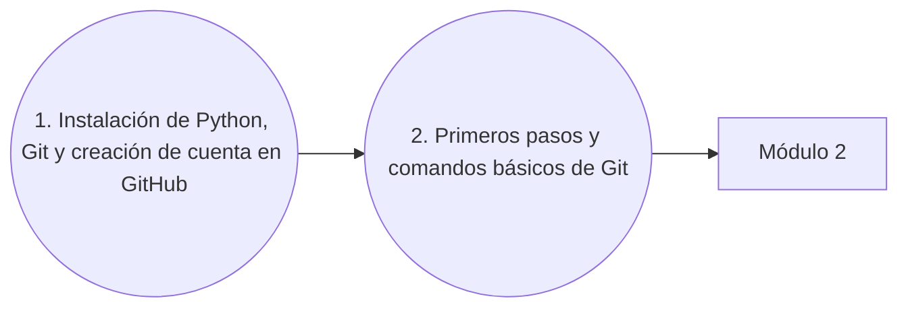

# Módulo 1: Herramientas Fundamentales

¡Bienvenido al módulo inicial! Aprenderemos a descargar e instalar Python y a manejar de forma básica Git. Algo imprescindible hoy en día.

---

## Flujo del módulo

##  Vídeos y contenido

### 1. Cómo descargar e instalar Python, instalar Git y crear cuenta en GitHub
> **Enlace al Vídeo:** [Ver vídeo en YouTube](https://youtu.be/ZDaW7sgYZzk)

**Contenido:**
* Instalación de Python
* Instalación de Git
* Configuración básica de Git
* Creación de cuenta en GitHub

### 2. Git Desde cero: Primeros Pasos y Comandos Básicos
> **Enlace al Vídeo:** [Ver vídeo en YouTube](https://youtu.be/il-ZSBh0PAo)

**Contenido:**
* ¿Qué es Git? y ¿Qué es GitHub?
* **Comandos Esenciales:** `git init`, `git branch`, `git status`, `git add`, `git commit`.
* ¿Qué es un Commit?
* **Conexión con GitHub:** `git remote add`, `git push`, `git clone`.
